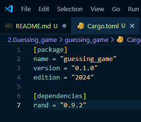

# learn_rust_lets_get_rusty

## [Video 2: Programming a Guessing Game in Rust!](https://www.youtube.com/watch?v=H0xBSbnQYds&list=PLai5B987bZ9CoVR-QEIN9foz4QCJ0H2Y8&index=2)

### This chapter covers about the following

- [Create a new Rust project named `guessing_game`.](#create-a-new-rust-project-named-guessing_game)
- [Prompt user to input a value and store that in a variable.](#prompt-user-to-input-a-value-and-store-that-in-a-variable)
- [Generate a Random number using Rand dependency.](#generate-a-random-number-using-rand-dependency)
- [Compare the user guess with random number using Ordering and match.](#compare-the-user-guess-with-random-number-using-ordering-and-match)

## Create a new Rust Project named `guessing_game`.

- To create a new rust project run `cargo new guessing_game`.

## Prompt user to input a value and store that in a variable.

- To get value from user input, we have to use `std::io` library.
- `io::stdin()` will initialize the user input and `read_line()` method will read the value input from user. `read_line()` will take a reference to a string and store it to the variable passed in to it.
- Finally print the value input provided by user.

## Generate a Random number using Rand dependency.

- Now we need to generate a random number and compare it with user guessed number. To do that, we have to include a dependency [rand](https://crates.io/crates/rand).

  

- Run `cargo build` to install the `rand` dependency. This will install all the required dependencies.
- Include the `rand` dependency in the main program using `use rand::Rng`.
- Now lets generate a random number using the rand and store it in a variable `secret_number`.

## Compare the user guess with random number using Ordering and match

- Now compare the random number generated and user guessed number to find if the user has guessed it correct.
- To compare, include `use std::cmp::Ordering` and use match statement to compare the values.
