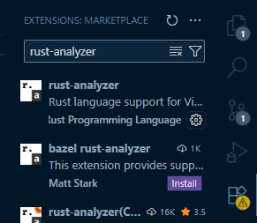
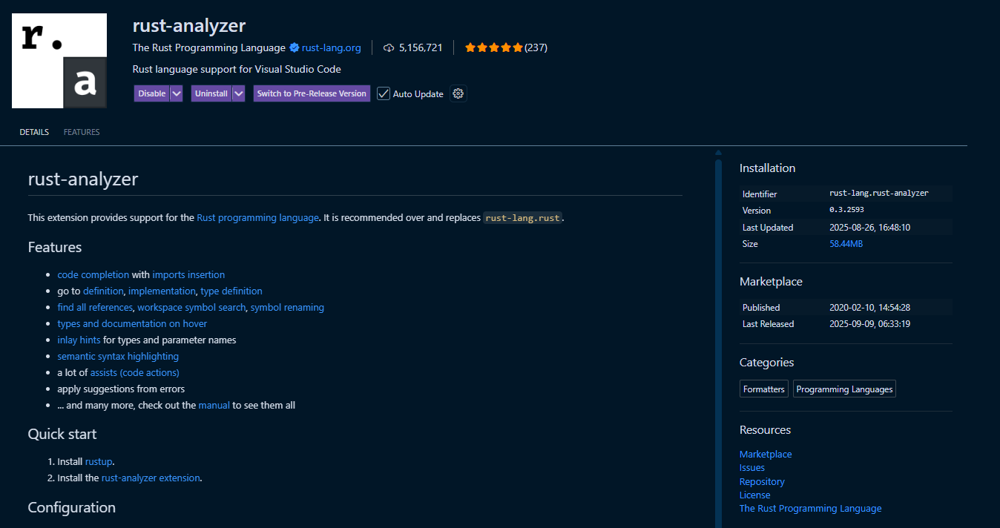
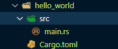

# learn_rust_lets_get_rusty

## Video 1: Getting Started with Rust - https://www.youtube.com/watch?v=OX9HJsJUDxA&list=PLai5B987bZ9CoVR-QEIN9foz4QCJ0H2Y8&index=1

This chapter covers about the following
Install Rust based on your Operating Systems.
Install Rust-analyzer extension in Visual Studio Code.
Create Hello World program in Rust.
Create first project(Hello World) using Cargo.
Build Project using Cargo.
Run Project using Cargo.
Cargo commands.

Install Rust based on your Operating Systems.
To install Rust in your machine based on your operating system follow the instructions from the rust book.
https://doc.rust-lang.org/book/ch01-01-installation.html#installation

Install Rust-analyzer extension in Visual Studio Code.
To get Rust based code suggestions and auto completion install the Visual Studio Code extension `rust-analyzer`.

Create Hello World program in Rust.
Create a directory `hello_world` and create a new file `main.rs`.
Create a `main` function and add a `println!` macro to print `Hello World`.

Create first project(Hello World) using Cargo.
To create your first Rust project using Cargo, run the below command
`cargo new hello_world`
This will create a new project named `hello_world`, this folder will contain src, .gitignore and Cargo.toml (similar to `package.json` in NodeJS to list project dependencies).

Build Project using Cargo.
To build your `hello_world` project, navigate to hello_world folder and run `cargo build`.
This will create `Cargo.lock` file similar to `package-lock.json` file and then a `target` folder which will contain `debug` information of the project.

Run Project using Cargo.
To execute the project, use the command `cargo run`, this will execute and print `Hello world!` in the command line.

Cargo commands.
To list all the cargo commands, run `cargo --help` in the command line.
